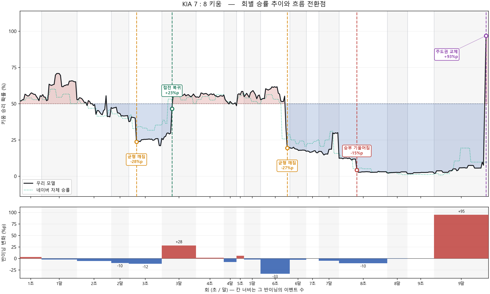

# KBO 실시간 승률 예측

야구 경기가 진행되는 동안, 지금 어느 팀이 이길 확률이 몇 퍼센트인지 계산한다.
숫자만 내놓지 않고 왜 그 숫자가 나왔는지, 경기 흐름이 어디서 바뀌었는지도 같이 보여준다.

> 네이버 스포츠의 공개 API를 사용한다. 로그인이나 토큰이 필요 없는 주소이고,
> 요청은 초당 2.5회로 제한해 두었다. 개인 학습 목적이며 수집한 데이터는
> 저작권이 네이버와 KBO에 있으므로 이 저장소에는 코드만 올린다.

```
──────────────────────────────────────────────────────────────────
  롯데 5 : 4 KIA   |  9회초   |  최근: 카스트로 : 삼진 아웃

  롯데  87.5%  ████░░░░░░░░░░░░░░░░░░░░░░░░░░   12.5% KIA

  [지금 승률을 만든 요인]
    ▼ 점수차/잔여아웃        -35.9%p   (값 -3.86)
    ▼ 점수차                -2.6%p   (값 -1)
    ▼ 홈팀 공격(말) 여부      -1.5%p   (값 0)

  [만약에]  (모두 KIA 기준 승률)
    · 홈팀이 1점 더 앞섰다면    →  52.0%  (+40.1%p)
    · 만루였다면              →   8.1%  ( -3.7%p)

  이 타석의 중요도: 평균 타석의 0.16배
──────────────────────────────────────────────────────────────────
```



---

## 무엇을 만들었나

기존에 만들었던 야구 프로젝트 두 개가 있는데, 둘 다 한계가 분명했다.

| | [KIA_VS_SAMSUNG](https://github.com/geonwoong-lee/KIA_VS_SAMSUNG) | [KBO_Data_Analysis](https://github.com/geonwoong-lee/KBO_Data_Analysis) | 이 프로젝트 |
|---|---|---|---|
| 무엇을 예측 | 시리즈 승패 | 선수 시즌 OPS | 경기 중 실시간 승률 |
| 데이터 | 엑셀 수기 입력 | Kaggle 정적 CSV | 네이버 중계 API 자동 수집 |
| 표본 | 16경기 | 선수×시즌 | 1,136경기 / 63만 건 |
| 평가 | 정답률 66.7% | R² | Log loss, Brier, 보정 곡선 |
| 설명 | 없음 | 변수 중요도 | WPA, SHAP, 반사실, 흐름 전환점 |

가장 큰 문제는 표본이 16경기였다는 것이다. 16경기로 나온 정답률 66.7%는
동전 던지기와 통계적으로 구분되지 않는다.

이번에는 데이터를 다르게 정의했다. 경기 하나를 한 줄로 보는 대신,
**경기 중 매 순간의 상황을 한 줄로** 봤다. 그러면 한 경기가 500줄 넘게 나온다.
같은 야구 경기인데 표본이 세 자릿수 늘어난다.

---

## 결과

2024~2026년 1,136경기로 학습했다. 908경기로 학습하고 228경기로 평가했다.

### 왜 정답률을 안 쓰는가

승부예측에서 정답률은 별로 쓸모가 없다. 9회말 5점 차 경기는 아무 모델이나 맞힌다.
정답률은 이런 쉬운 상황에 지배당한다.

대신 **log loss**를 쓴다. 이건 "80%라고 말한 상황 100번 중 실제로 80번 이겼는가"를
재는 지표다. 낮을수록 좋다. 자신 있게 말했는데 틀리면 벌점이 크게 붙는다.

### 테스트 결과 (228경기)

| 모델 | log loss | Brier | AUC |
|---|---|---|---|
| 상수 (홈 평균 승률만 답함) | 0.6934 | 0.2501 | 0.500 |
| 경험적 조회표 | 0.4990 | 0.1643 | 0.850 |
| 점수차 로지스틱 | 0.4216 | 0.1417 | 0.879 |
| 이 모델 | **0.4192** | **0.1406** | **0.881** |
| 네이버 자체 승률 (같은 구간) | 0.4279 | 0.1426 | 0.879 |
| 이 모델 (같은 구간) | 0.4327 | 0.1452 | 0.872 |

교차검증(908경기)에서도 같은 방향이 나왔다.
점수차 로지스틱 0.4581, 이 모델 0.4548, 네이버 구간 비교는 0.4559 대 0.4670이다.

정리하면 이렇다.

- **점수차만 쓰는 단순 모델은 이겼다.** 두 평가 방식 모두에서 이겼으니 우연은 아니다.
- **네이버 실서비스 승률에는 졌다.** 두 방식 모두에서 뒤진다.

네이버와 비교할 때는 네이버가 값을 내놓은 구간만 골라서 비교했다.
이미 승부가 갈린 쉬운 상황이 빠지기 때문에 양쪽 다 log loss가 높게 나온다.
같은 줄끼리 비교했으므로 공정하다.

개발 중간에 네이버를 이긴다는 수치가 나온 적이 있다. 확인해보니 코드 버그 때문이었고,
고치니까 사라졌다. 자세한 건 아래 "겪은 문제들"에 적었다.

### 모델이 야구를 이해했는지 확인

지표만으로는 부족해서 야구적으로 말이 되는지 따로 봤다.
점수가 같고 아웃도 없고 주자도 없는 완전히 동일한 상황에서,
초에서 말로 넘어갈 때 홈팀 승률이 얼마나 오르는지를 실제와 비교했다.

| 이닝 | 모델 예측 | 실제 |
|---|---|---|
| 2회 | +4.0%p | +3.8%p |
| 3회 | +6.3%p | +6.2%p |
| 4회 | +5.7%p | +5.5%p |
| 6회 | +9.7%p | +12.9%p |
| 평균 | +6.4%p | +7.2%p |

홈팀이 나중에 치는 이점이 후반으로 갈수록 커지는 것도 맞게 나왔다.
버그를 고치기 전에는 모델이 +9%p, 실제가 +5%p로 두 배 가까이 부풀려 있었다.

---

## 데이터

네이버 스포츠의 문자중계 API를 쓴다. 인증이 필요 없고 HTML을 긁을 필요도 없다.

| 주소 | 내용 |
|---|---|
| `/schedule/games` | 경기 일정과 결과 |
| `/schedule/games/{gameId}/relay?inning=N` | 이닝별 문자중계 |
| `/schedule/games/{gameId}/preview` | 선발투수, 라인업, 팀 순위 |

한 경기에서 평균 557개의 이벤트가 나온다. 투구 하나하나, 타석 결과, 주자 진루가 전부 들어있다.
그리고 **모든 이벤트에 그 순간의 게임 상황이 통째로 붙어 있다.**

```json
"currentGameState": {
  "homeScore":"0", "awayScore":"0",
  "out":"2", "ball":"0", "strike":"0",
  "base1":"5", "base2":"3", "base3":"2",
  "pitcher":"54640", "batter":"53312"
},
"speed":"146", "stuff":"투심", "pitchResult":"B"
```

### 문서가 없어서 직접 확인한 것들

이 API는 공식 문서가 없다. 그래서 응답을 직접 열어보며 규칙을 알아냈다.

1. 중계 기록이 **최신순으로 내려온다.** 그대로 쓰면 시간이 거꾸로 흐른다.
   `(textRelay.no, textOption.seqno)` 순으로 정렬해야 한다.
2. `base1/2/3`은 주자가 있냐 없냐를 나타내는 0/1이 아니라 **그 주자의 타순 번호**다.
   `base1:"5"`면 5번타자가 1루에 있다는 뜻이다.
3. 게임 상황은 **그 이벤트가 일어난 직후** 기준이다. 삼진 이벤트를 보면 아웃카운트가 이미 올라가 있다.
4. `metricOption`에 네이버가 계산한 승률이 타석마다 들어있다.
   비교 기준으로 쓰되 모델 입력으로는 절대 넣지 않았다.
5. `currentPlayersInfo`는 이벤트마다 바뀌지 않는다. 응답 전체에 하나로 고정돼 있다.
   여기서 선수 성적을 뽑으면 경기 내내 같은 값이 들어간다.
6. 선수 성적은 `batterRecord.seasonHra`(타자)와 `Lineup.pitcher[].seasonEra`(투수)에서 가져와야 한다.
7. 타자의 상대 투수 상대 타율(`vsHra`)은 **홈팀 타자만 계산된다.** 원정 타자는 전부 0.000이다.
8. 일정 조회는 한 번에 310경기 정도만 응답한다. 월 단위로 나눠 요청해야 시즌 전체가 잡힌다.

### 수집

```bash
python -m src.collect --season 2026 --workers 3
```

받은 경기 목록을 체크포인트에 남겨서 중간에 끊겨도 이어받는다. 40경기마다 파일로 저장한다.
수집 도중 실제로 겪은 문제들 때문에 다음 장치를 넣었다.

- 수집기를 두 번 실행하면 두 번째가 멈춘다. 동시에 돌면 체크포인트를 서로 덮어쓴다.
- 네트워크 실패와 "데이터 없음"을 구분한다. 구분하지 않으면 통신이 한 번 끊겼을 때
  그 이닝을 경기 끝으로 착각한다.
- 이닝 번호에 구멍이 있으면 저장을 거부한다. 다만 종료 이닝은 일정 API가 알려주는 값과 비교한다.
  비로 중단된 콜드게임은 7회에 끝나기도 하기 때문이다.

---

## 모델

**푸는 문제** — 경기 중 어떤 상황이 주어졌을 때, 홈팀이 최종적으로 이길 확률은?

한 줄이 경기의 한 상황이고, 정답은 그 경기의 최종 승패다.
3아웃이 찍힌 줄은 다음 이닝 시작 상황(0아웃, 주자 없음)으로 바꿔 준다.
그래야 같은 상황이 항상 같은 값으로 표현된다.

### 쓰는 정보 14개

| 묶음 | 항목 |
|---|---|
| 점수와 시간 | 점수차, 점수차×진행도, 점수차÷잔여아웃, 공격팀 남은 아웃, 수비팀 남은 아웃, 초/말 |
| 주자와 카운트 | 주자 상황(8가지), 득점기대값, 잔여 득점 잠재력, 아웃, 볼, 스트라이크, 끝내기 기회, 홈팀 마지막 공격 |

세 개만 설명하면 나머지는 이름 그대로다.

**남은 아웃카운트.** 3점 차는 1회에는 별것 아니지만 9회에는 사실상 끝이다.
이 차이는 "몇 회인가"로는 표현이 안 된다. "각 팀에게 아웃이 몇 개 남았나"로 표현해야 한다.
9회 기준 27개에서 역산한다.

**점수차 ÷ 남은 아웃.** 위 논리를 한 값으로 압축한 것이다.
같은 3점 차라도 남은 아웃이 적으면 값이 커진다.
모델이 판단에 쓰는 비중의 66.8%를 이 하나가 차지한다.

**득점기대값(RE24).** 주자와 아웃 조합 24가지 각각에서 앞으로 몇 점이 더 날지의 평균값이다.
"2아웃 만루"와 "무사 1루"가 왜 다른지를 숫자로 알려주는 역할이다.
학습에 쓴 경기에서만 계산한다.

### 답을 미리 알려주지 않기

예측 모델에서 가장 흔한 사고는 모델이 답을 미리 보는 것이다. 네 군데를 막았다.

| 위험 | 대응 |
|---|---|
| 같은 경기의 1회와 9회가 학습·평가로 갈리면 답이 샌다 | 나눌 때는 항상 경기 단위로 |
| 최종 스코어 같은 미래 정보 | 정답 외에는 그 시점까지의 값만 사용 |
| 득점기대값을 평가용 경기로 계산 | 학습 경기에서만 계산 |
| 투수 ERA가 경기 후 값으로 들어감 | 라인업에 처음 등장했을 때 값을 사용 |

마지막 항목은 놓치기 쉽다. 오늘 얻어맞은 투수는 경기가 끝나면 ERA가 올라간다.
그 값을 쓰면 "오늘 못 던졌다"는 결과가 예측에 거꾸로 흘러들어간다.

### 학습

LightGBM을 쓴다. 점수 관련 항목에는 단조 증가 제약을 걸었다.
점수차가 커지는데 승률이 떨어지는 구간이 생기면 그건 모델이 아니라 버그이기 때문이다.

부스팅 라운드 수와 확률 보정 방식은 학습 경기 안에서 5겹 교차검증으로 정한다.
별도 검증 데이터를 따로 떼지 않는데, 이유는 아래에 있다.

---

## 겪은 문제들

성능 수치보다 이쪽이 이 프로젝트에서 얻은 게 많다.

앞의 세 개는 같은 사실에서 나온다. **독립적인 표본은 줄 수가 아니라 경기 수다.**
한 경기가 550줄을 만들지만 그 줄들은 전부 같은 정답을 공유한다.
줄이 60만 개여도 실제로 서로 다른 사례는 1,136개뿐이다.

### 모델이 야구가 아니라 경기를 외웠다

첫 학습에서 LightGBM이 파라미터 4개짜리 로지스틱 회귀에 졌다(0.4162 대 0.3984).
무엇을 보고 판단하는지 열어봤더니, 경기 내내 값이 변하지 않는 항목
두 개(양 팀 선발 ERA 차이, 팀 승률 차이)가 판단 비중의 38.6%를 먹고 있었다.

183경기밖에 없을 때 그 두 값의 조합은 사실상 경기 고유번호다.
야구 상황을 배우는 것보다 183개 경기를 통째로 외우는 게 손실을 더 빨리 줄인다.

경기 전 정보를 빼고 상황에서 유도되는 값을 넣자 0.3981로 내려갔다.

### 파라미터 튜닝은 소용없었다

주자·카운트 항목의 비중이 0.5%까지 떨어져서 "규제를 너무 세게 걸어 신호가 눌렸나" 싶었다.
6가지 설정으로 탐색했더니 결과가 0.4647에서 0.4661 사이에 다 들어왔다. 차이가 0.0014다.

용량 문제가 아니었다. 가설이 틀렸다는 걸 확인하고 특성 쪽으로 방향을 돌렸다.

### 검증 점수가 제일 좋은 보정기가 실전에서 제일 나빴다

트리 모델이 내놓는 확률은 0이나 1 쪽으로 치우치는 경향이 있어서 보정이 필요하다.
교과서적인 선택은 isotonic regression인데, 두 번 시도해서 두 번 다 실패했다.

| 시도 | isotonic 검증 | isotonic 테스트 | 보정 안 함 |
|---|---|---|---|
| 홀드아웃 52경기 | 0.4990 (1위) | 0.4401 | 0.4102 |
| 교차검증 320경기 | 0.4552 (1위) | 0.4948 | 0.4917 |

isotonic은 계단 함수다. 확인해보니 서로 다른 예측값 9,973개를 50단계로 뭉개고 있었다.

정확도만 나빠지는 게 아니다. WPA는 승률의 변화량인데,
보정기의 계단이 그대로 "승부처"로 잘못 잡힌다.
4회 동점 상황의 평범한 3루수 땅볼 아웃에 WPA +36.9%p가 찍혔고,
똑같은 값이 한 경기에서 네 번 반복된 걸 보고 알아챘다.

그래서 보정기를 정확도만으로 고르지 않게 바꿨다.
후보를 전부 학습해서 점수와 함께 **출력값이 몇 단계로 나뉘는지**를 같이 기록하고,
경기 수가 충분할 때만 isotonic을 후보에 넣는다.

### 같은 항목이 반이닝마다 반대로 작동했다

"지금 던지는 투수의 ERA"는 초에는 홈 투수 것이고 말에는 원정 투수 것이다.
같은 칸에 들어있는 값이 반이닝마다 정반대 의미가 된다.

증상으로는 점수가 같은데 초에서 말로 넘어갈 때 승률이 실제보다 두 배 크게 흔들렸다.

선수 관련 항목을 전부 "홈팀에 유리하면 +"로 방향을 통일했다.
그랬더니 부수적으로 단조 제약도 걸 수 있게 됐다.

그런데 여기서 더 깊은 버그가 나왔다. 3아웃 줄은 상황이 다음 이닝으로 넘어가는데
선수 정보는 이전 이닝 것이 그대로 남아 있어서, 방향만 뒤집혔다.
2대2 동점인데 4회말 33.3%에서 5회초 58.6%로 25%p가 튀었다.
타자 항목 하나가 −16.3%p에서 +12.8%p로 혼자 29%p를 흔들고 있었다.

방향을 정할 때 선수 정보가 실제로 속한 반이닝을 보도록 고쳤다. 튐이 12.1%p로 줄었다.

### 선수 정보는 승률에 도움이 안 됐다

처음엔 선수 정보가 제일 중요한 줄 알았다. 빼면 성능이 가장 크게 나빠졌으니까.
그런데 그게 전부 버그 때문이었다.

**첫 번째 — 투수 ERA와 타자 타율.**
`currentPlayersInfo`가 이벤트마다 안 바뀌는 필드라서, 두 값이 경기 내내 고정돼 있었다.

| 타자 | 실제 시즌 타율 | 모델이 본 값 |
|---|---|---|
| 서건창 | 0.319 | 0.100 |
| 박주홍 | 0.231 | 0.100 |
| 권혁빈 | 0.222 | 0.100 |

올바른 출처로 고쳐서 다시 재니 기여가 0이 됐다.

**두 번째 — 상대 전적.**
타자가 이 투수에게 얼마나 잘 쳤는지가 API에 있긴 하다.
그런데 홈팀 타자만 계산되고 원정 타자는 전부 0.000이다.
이걸 넣으면 "말에만 값이 있는" 항목이 되어 초/말을 다시 인코딩할 뿐이다.
게다가 표본이 통산 8타수 수준이라 오차가 너무 크다. 쓸 수 없었다.

**세 번째 — 좌우 매치업.**
왼손 타자가 오른손 투수를 상대할 때 유리하다는 건 야구의 기본이다.
좌우 정보는 양 팀 모두 있고, 선수마다 고정된 값이라 경기 상수 문제도 없고,
표본도 타자당 수백 타석이라 넉넉하다.
424명 조회표를 만들어 붙였다. 매칭 실패 0%, 좌우 분포도 균형이 맞았다.

| 쓰는 정보 | 개수 | log loss |
|---|---|---|
| 현재 (점수·시간·주자·카운트) | 14 | 0.4479 |
| + 좌우 매치업 | 15 | 0.4479 |
| + 좌우 + 시즌 성적 | 17 | 0.4479 |
| + 시즌 성적만 | 16 | 0.4479 |

소수점 넷째 자리까지 똑같다. 데이터에 아무 문제가 없는데도 기여가 없었다.

야구적으로 생각해보면 말이 된다.
좌우 매치업은 **지금 이 타석의 결과**에는 분명히 영향을 준다. 리그 평균 타율 2~3푼 차이가 난다.
하지만 우리가 예측하는 건 **경기 최종 승패**다.
지금 타석 하나의 기댓값이 조금 오르내려도, 남은 20~40타석에서 좌우가 뒤섞이며 평균으로 씻긴다.
게다가 감독이 대타와 불펜으로 이미 최적화하고 있어서 남는 효과는 더 작다.

결국 쓰는 정보를 24개에서 19개, 다시 14개로 줄이는 동안 성능은 계속 좋아졌다.
경기 중 승률은 점수와 남은 아웃이 지배하고, 개별 선수 정보는 희석된다.

### 수집하다 터진 것들

| 사고 | 증상 | 대응 |
|---|---|---|
| 수집기를 두 번 실행 | 체크포인트를 서로 덮어써 157경기가 사라짐 | 잠금 파일 |
| 통신 실패를 데이터 없음으로 착각 | 6회가 통째로 빠진 경기가 정상으로 저장됨 (4건) | 예외 구분 + 이닝 연속성 검사 |
| 종료 이닝을 9회로 가정 | 비로 중단된 7회 종료 경기를 영영 못 받음 | 일정 API 값과 비교 |
| 시즌 초 성적이 0 | 3월 평균 ERA가 0.30 (4월은 4.64) | 경과일 기준으로 리그 평균 쪽으로 축소 |
| 3아웃 줄의 소속 표기 | 2회초를 끝낸 아웃이 2회말 대표 플레이로 표시 | 원래 소속을 따로 보관 |
| 가정을 바꿀 때 파생값 미갱신 | "1점 더 앞섰다면" 예측이 통째로 틀림 | 파생값 계산을 한 함수로 통일 |

---

## 설명 기능

승률만 내놓으면 현장에서 쓸 수 없다. 왜 그 숫자인지가 같이 나와야 판단이 된다.

### WPA — 방금 그 플레이가 승률을 얼마나 바꿨나

승률의 변화량이다. 안타 하나로 승률이 40%에서 55%로 올랐다면 WPA는 +15%p다.
야구계에서 이미 쓰는 개념이라 따로 설명할 필요가 없고, 모델과 무관하게 정의된다.

### SHAP — 지금 이 승률을 만든 요인

기준 승률에서 출발해 각 항목이 몇 %p씩 밀어올렸는지 나눈다.
로그오즈 같은 단위 대신 %p로 바꿔서, 다 더하면 현재 승률이 되게 했다.

### 반사실 — 만약 무사였다면

상황을 하나만 바꿔서 다시 계산한다. 변화가 클수록 그 조건이 지금 중요하다는 뜻이다.
가정을 바꾼 뒤에는 파생값을 반드시 다시 계산해야 한다. 안 하면 답이 통째로 틀린다.

### 레버리지 — 이 타석이 승부를 흔들 폭

다음 타석에서 나올 수 있는 결과(아웃, 볼넷, 안타, 2루타, 홈런)에
각각의 발생 확률을 곱해 승률이 얼마나 움직일지의 기댓값을 낸다.
평균적인 타석의 몇 배인지로 표시한다.

3배가 넘으면 여기가 승부처라는 뜻이고, **불펜을 언제 쓸지 판단하는 데 바로 쓰인다.**

### 회별 승률 추이

가로축을 이벤트 번호로 두면 1회가 40칸, 5회가 15칸을 차지해서 야구적 의미가 없다.
그래서 반이닝 단위로 요약했다. 한 경기가 18~20줄이 되고 각 줄이 실제 이닝과 1:1로 대응한다.

각 반이닝의 종료 승률을 "다음 반이닝의 시작 승률"로 정의해서,
변화량을 다 더하면 경기 전체 변화와 정확히 맞아떨어지게 했다.

### 흐름 전환점

승률을 크게 흔든 플레이와는 다른 개념이다.
8대1로 앞선 상황의 홈런은 WPA가 커도 판세를 바꾸지 않는다. 이미 끝난 경기다.

그래서 승률을 다섯 구간(홈 결정적 / 홈 우세 / 접전 / 원정 우세 / 원정 결정적)으로 나누고,
**구간이 실제로 넘어간 순간**만 잡는다.

```
[균형 깨짐]    3회초 2-0   접전 → 원정 우세      50.3% → 26.1%
              결정적이었던 플레이: 김건희 : 삼진 아웃 (-14.8%p)
[승부 기울어짐] 6회말 4-2   접전 → 원정 결정적    40.6% → 12.7%
[주도권 교체]   9회말 7-8   원정 결정적 → 홈 결정적 12.7% → 95.5%
              결정적이었던 플레이: 3루주자 추재현 : 홈인 (+52.7%p)
```

경계에서 승률이 오르내릴 때마다 전환으로 잡으면 잡음이 쏟아진다.
3~5회가 사실상 한 국면인데 전환이 4건 찍힌 적이 있다.
경계를 넘을 때 여유를 두고, 새 구간이 일정 시간 유지되어야 하고,
누적 변화가 일정 수준 이상이어야 인정하도록 세 겹으로 걸렀다. 9건이 4건으로 정리됐다.

경기 막판에는 남은 이벤트가 유지 조건보다 적다.
이걸 빠뜨리면 끝내기 역전 같은 가장 큰 전환점이 통째로 누락된다.

---

## 실행 방법

```bash
pip install -r requirements.txt

python -m src.collect --season 2026 --workers 3   # 데이터 수집
python -m src.handedness --games 45               # 선수 좌우 조회표 (선택)
python -m src.train                               # 학습과 평가
python -m src.tune --ablate                       # 어떤 정보가 실제로 도움되는지 검증

python -m src.live --replay 20260823HTWO02026     # 끝난 경기 다시 보기
python -m src.live --auto                         # 진행 중인 경기 실시간
streamlit run app/dashboard.py                    # 대시보드
```

---

## 폴더 구조

```
config.py               설정 (경로, API, 요청 간격)
src/naver_api.py        API 클라이언트
src/parser.py           중계 JSON을 시간순 이벤트 표로 변환
src/collect.py          대량 수집 (잠금, 체크포인트, 무결성 검사)
src/features.py         쓰는 정보 계산, 득점기대값, 상황 정규화
src/handedness.py       선수 좌우 조회표 생성
src/train.py            학습, 보정, 비교, 리포트
src/calibrate.py        확률 보정기 선택
src/tune.py             파라미터 탐색, 정보 조합 검증
src/explain.py          WPA, SHAP, 반사실, 레버리지
src/flow.py             회별 추이, 흐름 전환점
src/live.py             실시간 폴링
src/viz.py              승률 곡선 차트
app/dashboard.py        Streamlit 대시보드
reports/                평가 리포트 (자동 생성)
```

코드 약 3,000줄.

---

## 발전 가능성

**표본 확대.** 2019~2023년을 더 받으면 약 4,700경기가 된다.
지금 결론들이 그 규모에서도 유지되는지 확인해야 한다.
특히 "경기 전 정보가 해롭다"는 결론은 경기 수가 적어서 나온 것일 수 있다.

**네이버와의 격차 분석.** 어느 국면에서 지는지를 구간별로 쪼개보면
무엇이 부족한지 알 수 있다. 초반인지 후반인지, 접전인지 큰 점수차인지.

**불펜 상태.** 연투 여부, 최근 3일 투구수 같은 정보는 표본 문제가 없고
승률에 실제로 영향이 있을 만하다. 선수 개인 성적과 달리 팀 단위 상태라 희석되지도 않는다.

**불펜 투입 시점 시뮬레이션.** 레버리지를 이미 계산하고 있으니,
"이 투수를 지금 쓸 때와 다음 이닝에 쓸 때 승률 기댓값이 얼마나 다른가"를 계산할 수 있다.
전력분석 현장에서 바로 쓰일 형태다.

**포스트시즌 별도 보정.** 단기전은 정규시즌과 운영 방식이 다르다.
불펜을 아끼지 않고 대타 타이밍도 빨라진다. 같은 모델을 쓰면 안 맞을 가능성이 있다.
