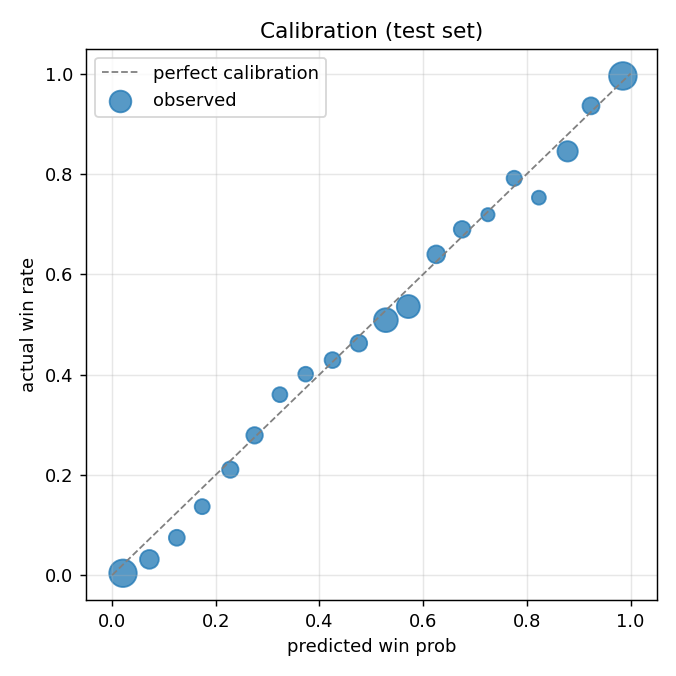

# 승률 모델 평가 리포트

- 학습 경기 908 / 테스트 경기 228
- 테스트 행 수 76,802 (투구·타석 단위 상태)
- 5-fold GroupKFold OOF log loss **0.4548** · 최종 라운드 288

## 베이스라인 비교 — OOF (908경기 / 312,230행)

| model                 |   log_loss |   brier |    auc |    acc |      n |
|:----------------------|-----------:|--------:|-------:|-------:|-------:|
| 1. 상수(홈 승률 평균) |     0.693  |  0.2499 | 0.5    | 0.5093 | 312230 |
| 2. 점수차 로지스틱    |     0.4581 |  0.1524 | 0.8585 | 0.7584 | 312230 |
| 3. 경험적 조회표      |     0.5189 |  0.172  | 0.8339 | 0.7532 | 312230 |
| 4. LightGBM [최종]    |     0.4548 |  0.1512 | 0.8615 | 0.7677 | 312230 |

> 테스트 홀드아웃은 경기 수가 적어 분할 운에 따라 순위가 뒤집힌다. 같은 폴드에서 만든 OOF 예측으로 비교하면 학습 경기 전체가 표본이 되어 안정적이다.

## 네이버 비교 — OOF (한쪽으로 기울지 않은 301,713행)

| model            |   log_loss |   brier |    auc |    acc |      n |
|:-----------------|-----------:|--------:|-------:|-------:|-------:|
| 네이버 자체 승률 |     0.4559 |  0.1516 | 0.8627 | 0.7668 | 301713 |
| 이 모델          |     0.467  |  0.1554 | 0.8536 | 0.761  | 301713 |

## 베이스라인 비교 — 테스트 (228경기 / 76,802행)

| model                              |   log_loss |   brier |    auc |    acc |     n |
|:-----------------------------------|-----------:|--------:|-------:|-------:|------:|
| 1. 상수(홈 승률 평균)              |     0.6934 |  0.2501 | 0.5    | 0.4972 | 76802 |
| 2. 점수차 로지스틱                 |     0.4216 |  0.1417 | 0.8791 | 0.7761 | 76802 |
| 3. 경험적 조회표                   |     0.499  |  0.1643 | 0.8496 | 0.7619 | 76802 |
| 4. LightGBM (보정 전)              |     0.4192 |  0.1406 | 0.8805 | 0.7765 | 76802 |
| 5. LightGBM + identity 보정 [최종] |     0.4192 |  0.1406 | 0.8805 | 0.7765 | 76802 |

## 네이버 비교 — 테스트 (한쪽으로 기울지 않은 73,890행)

| model            |   log_loss |   brier |    auc |    acc |     n |
|:-----------------|-----------:|--------:|-------:|-------:|------:|
| 네이버 자체 승률 |     0.4279 |  0.1426 | 0.879  | 0.7753 | 73890 |
| 이 모델          |     0.4327 |  0.1452 | 0.8724 | 0.7689 | 73890 |

> 베이스라인 표와 채점한 행이 다르다. 두 표의 숫자를 가로질러 비교하면 안 된다.

> Log loss / Brier 는 낮을수록 좋다. 승부예측에서 중요한 것은 정답률이 아니라 확률의 정확도다.

## 교차검증 폴드

|   fold |   n_games |   best_iter |   log_loss |
|-------:|----------:|------------:|-----------:|
|      1 |       177 |         169 |     0.4794 |
|      2 |       177 |         273 |     0.4812 |
|      3 |       177 |         336 |     0.439  |
|      4 |       178 |         288 |     0.4137 |
|      5 |       177 |         301 |     0.4609 |

## 보정기 선택

| kind     |   valid_log_loss |   distinct_outputs | eligible   | chosen   |
|:---------|-----------------:|-------------------:|:-----------|:---------|
| identity |           0.4548 |               2001 | True       | True     |
| platt    |           0.4548 |               2001 | True       | False    |
| isotonic |           0.453  |                107 | False      | False    |

> 계단형 보정기(isotonic)는 log loss 는 좋아 보여도 승률 곡선을 계단으로 만들어 WPA 에 가짜 점프를 만든다. 그리고 경기 수가 적으면 검증셋을 외워버린다. 그래서 뚜렷한 차이가 없으면 매끄러운 쪽을 택한다.

## 이닝별 성능

|   inning |    n |   brier |   mean_pred |   actual |
|---------:|-----:|--------:|------------:|---------:|
|        1 | 8848 |  0.2285 |       0.528 |    0.518 |
|        2 | 8340 |  0.1955 |       0.521 |    0.511 |
|        3 | 8478 |  0.1828 |       0.521 |    0.521 |
|        4 | 8253 |  0.1668 |       0.538 |    0.524 |
|        5 | 8427 |  0.1375 |       0.528 |    0.51  |
|        6 | 8594 |  0.1232 |       0.531 |    0.522 |
|        7 | 9229 |  0.108  |       0.526 |    0.512 |
|        8 | 9114 |  0.0627 |       0.508 |    0.501 |
|        9 | 6746 |  0.0483 |       0.368 |    0.355 |
|       10 |  662 |  0.1483 |       0.272 |    0.213 |

## 특성 중요도 (gain 기준)

| feature            |             gain |   share |
|:-------------------|-----------------:|--------:|
| score_per_out_left |      2.15081e+06 |  0.6679 |
| score_x_progress   | 524614           |  0.1629 |
| score_diff         | 357251           |  0.1109 |
| run_exp             |  62591.8         |  0.0194 |
| is_bottom          |  39783.1         |  0.0124 |
| outs_left_bat      |  27750.8         |  0.0086 |
| run_potential      |  26637.5         |  0.0083 |
| base_state         |  15118.2         |  0.0047 |
| outs_left_field    |   8488.2         |  0.0026 |
| outs               |   2740.81        |  0.0009 |
| balls              |   2735.64        |  0.0008 |
| strikes            |   1540.4         |  0.0005 |
| is_last_at_bat     |    235.802       |  0.0001 |
| is_walkoff_chance  |    117.295       |  0      |

## 보정 곡선

